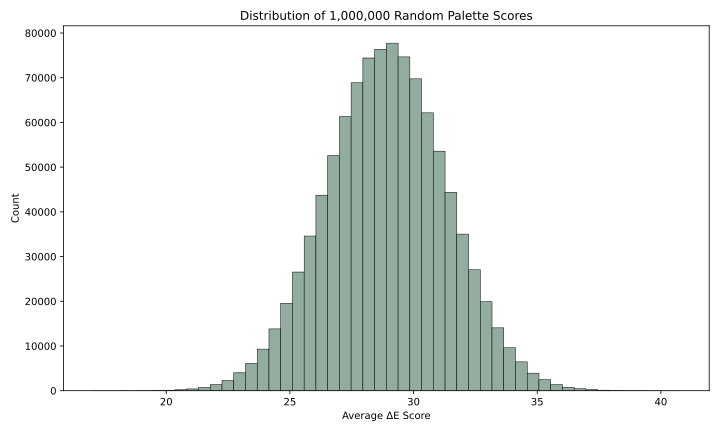
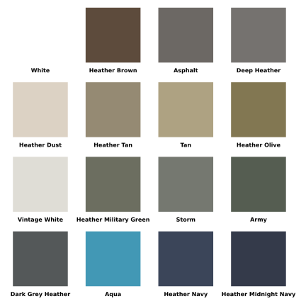
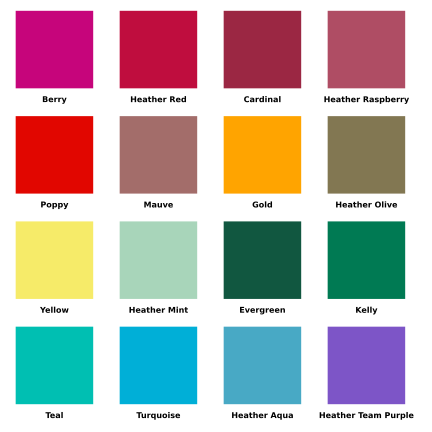
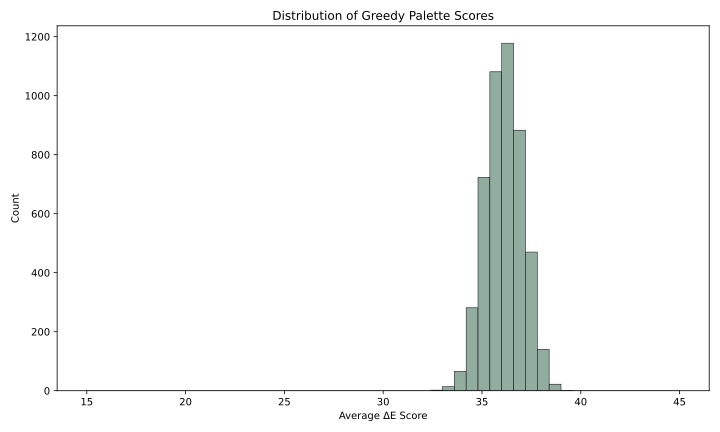
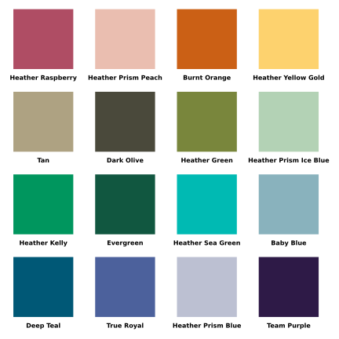
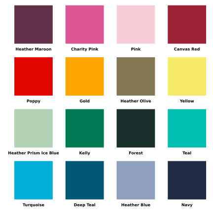
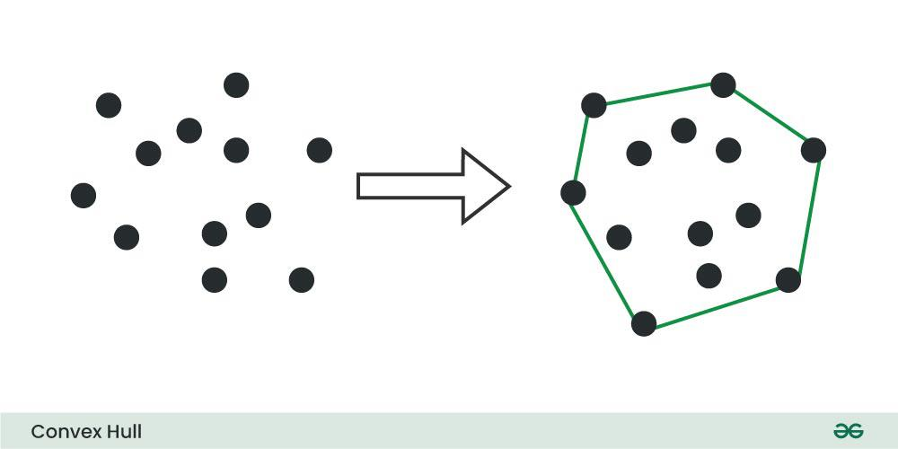
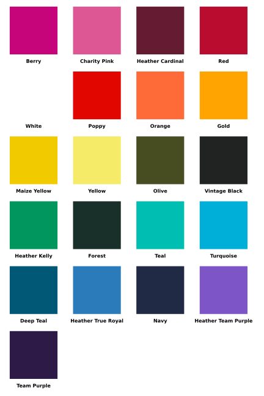
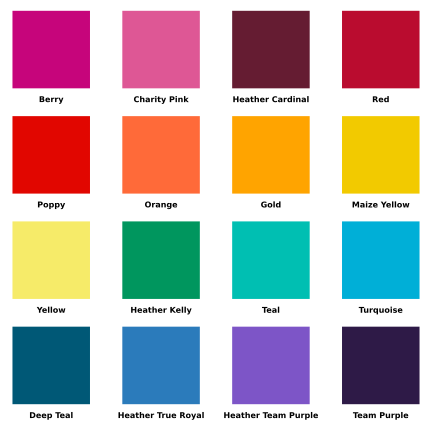

 In part one, we determined which team colors would be best to add to the upcoming dodgeball season. We wanted to select colors that would be different from those already chosen, as teams with similar colors are hard to tell apart. We used LAB-Color-Distance formulas to select colors that are most distant and chose from those.

The similar-color-problem in Part 1 arose because teams are allowed to select from 103 shirt colors. Many of these colors are very similar, so it is easy for teams to select colors that are hard to tell apart. What if we wanted to avoid this situation entirely?

Instead of letting teams pick from 103 colors, we gave them 16 or 24 colors to select from, and we guaranteed that all the colors are far enough apart to not appear too similar. 


## Lots of Combinations

One way to approach this problem is to select the 16 colors that have the greatest average distance between them. This would work, however...

If we want to pick 16 colors, we must score **2,245,547,413,628,550,570** possible combinations! (2 quintillion)

And if we want to pick 24 colors, we must score **178,409,928,551,259,450,861,900** possible combinations! (178 sextillion)

To put those numbers into context, it would take ~10 days of compute time to find the 16 best colors, and **~2175 years, 328 days, and 17 hours of compute time to find the 24 best colors\*!**^[Assuming we're running on an Apple M1 Chip]

## The Maximum Diversity Problem

What we're attempting to do, finding a subset of colors with an optimal distance between them, is a variation of the [Maximum Diversity Problem](https://grafo.etsii.urjc.es/optsicom/mdp.html). 

The Maximum Diversity Problem falls into a class of computer science problems that are NP-Hard, or functionally unsolvable. We see the NP-Hard characteristics of our color selection problem when the compute time goes from 10 days to 2175 years by adding 8 additional colors to the number of colors we are selecting.

We can work around the complexity of our problem with a heuristic. A heuristic is a problem-solving technique that uses shortcuts to find an approximate solution quickly. 

### A Note On Scoring

For this article we will score our color palettes based off of the average ∆E distance between all the colors in a set. This maximizes the global diversity of the set - which is exactly what we're trying to tackle with the Maximum diversity problem. 

You can see the scoring function in the cell below: 

```{python}
def compute_score(color_indices: list[int], distance_matrix) -> float:
    """
    Returns the average CIE 2000 distance between input colors.
    """
    total_distance = 0
    for i, j in combinations(color_indices, 2):
        total_distance += abs(distance_matrix[(i,j)])

    total_pairs = comb(len(color_indices), 2)

    average_distance = total_distance/total_pairs

    return average_distance
```

Now we can setup our notebook and begin: 

```{python}
#| output: false

%load_ext autoreload
%autoreload 2

# This cell exists just to setup the python environment
import pandas as pd
import numpy
from colormath import color_objects, color_diff
import random
from itertools import combinations
from math import comb
import time
from IPython.display import display, Markdown
import pickle
from pathlib import Path


# Fixes issue with the colormath library
def patch_asscalar(a):
    return a.item()
setattr(numpy, "asscalar", patch_asscalar)
```

## Heuristic 1: Randomly Select Colors

A simple heuristic we can use is randomly selecting colors from the set of 103. This likely won't yield the best results, but scoring these random selections provides a useful baseline for future algorithms.

I selected 1,000,000 random color combinations and calculated the average, lowest, and highest score: 


```{python}
#| code-fold: true
#| cache: true 
#| output: false

from dodgeball_colors_3 import build_distance_matrix

color_df = pd.read_csv("../../data/all_colors.csv")

lab_string = list(color_df["L*a*b Value"])
lab_strings = [color_string.split(", ") for color_string in lab_string]

lab_floats = [[float(x) for x in row] for row in lab_strings]

lab_colors = [color_objects.LabColor(lab_l=lab_color[0], lab_a=lab_color[1], lab_b=lab_color[2]) for lab_color in lab_floats]

distance_matrix = build_distance_matrix(lab_colors)

cache_file = Path("assets/scored_samples.pkl")
RERUN = False 
if cache_file.exists() and not RERUN:
    cached = pickle.loads(cache_file.read_bytes())
    scored_samples = cached["scored_samples"]
    elapsed_time = cached["elapsed_time"]
else:
    start_time = time.time()
    samples = [random.sample(range(103), 16) for _ in range(1_000_000)]
    scored_samples = {tuple(s): compute_score(s, distance_matrix) for s in samples}
    elapsed_time = time.time() - start_time
    cache_file.write_bytes(pickle.dumps({
        "scored_samples": scored_samples,
        "elapsed_time": elapsed_time,
    }))
```


```{python}
from dodgeball_colors_3 import display_palette

best = max(scored_samples, key=scored_samples.get)
worst = min(scored_samples, key=scored_samples.get)

table = f"""
| Metric | Score | Unit |
|---|---|---|
| Total Runtime | {elapsed_time:.2f} | Seconds |
| Average Score | {sum(scored_samples.values()) / len(scored_samples):.2f} | Perceived LAB Color Distance |
| Lowest Score | {scored_samples[worst]:.2f} | Perceived LAB Color Distance |
| Highest Score | {scored_samples[best]:.2f} | Perceived LAB Color Distance |
"""

display(Markdown(table))

display_palette(selected_colors=list(best), color_df=color_df, filepath="assets/best_random.svg", sort_rainbow=True, hide_output=True)

display_palette(selected_colors=list(worst), color_df=color_df, filepath="assets/worst_random.svg", sort_rainbow=True, hide_output=True)
```

Here is the score distribution (in Heathe Prism Dusty Blue):



```{python}
from dodgeball_colors_3 import plot_score_histogram

plot_score_histogram(
    scores=list(scored_samples.values()),
    filepath="assets/score_distribution.svg",
    bins=50,
    title="Distribution of 1,000,000 Random Palette Scores",
    color='#92ACA0',
    hide_output=True,
    min_x=15,
    max_x=45
)  
```

Here is the low scoring palette (avg 17.03 ∆E):



How drab.

Here is the high scoring palette (avg 40.77 ∆E) :



How vibrant! But can we do better? Heather Red, Cardinal, and Heather Raspberry appear quite similar. 

## Heuristic 2: Greedy Algorithms

Greedy algorithms work by picking the best option at each step of the algorithm. In our case, the greedy algorithm will take two points and then iteratively select the 14 points that have the greatest minimum distance from the current set.

We can easily run this algorithm on our set of points as there are only $\binom{103}{2} = 5{,}253$ possible starting combinations. 

```{python}
#| cache: true
#| 
def parse_lab(lab_string: str) -> color_objects.LabColor:
    L, a, b = (float(x) for x in lab_string.split(", "))
    return color_objects.LabColor(lab_l=L, lab_a=a, lab_b=b)

color_df["LabColor"] = color_df["L*a*b Value"].apply(parse_lab)

def greedy_search(colors: pd.DataFrame, distance_matrix, num_colors: int, start_a: int, start_b: int):
    n = len(colors)
    selected = set()
    selected.add(start_a)
    selected.add(start_b)

    while len(selected) < num_colors:
        max_min_dist = -1
        best_point = -1

        for i in range(n):
            if i not in selected:
                min_dist = min(distance_matrix[(i, j)] for j in selected)
                if min_dist > max_min_dist:
                    max_min_dist = min_dist
                    best_point = i

        selected.add(best_point)

    return list(selected)


cache_file = Path("assets/greedy_results.pkl")
GREEDY_RERUN = False 
if cache_file.exists() and not RERUN:
    cached = pickle.loads(cache_file.read_bytes())
    greedy_scores = cached["greedy_scores"]
    greedy_elapsed_time = cached["greedy_elapsed_time"]
else:
    greedy_start_time = time.time()
    greedy_results = []
    for i, j in combinations(range(0,103),2):
        result = greedy_search(colors=color_df, distance_matrix=distance_matrix, num_colors=16, start_a=i, start_b=j)
        greedy_results.append(result)
    greedy_scores = {tuple(s): compute_score(s, distance_matrix) for s in greedy_results}
    greedy_elapsed_time = time.time() - greedy_start_time
    cache_file.write_bytes(pickle.dumps({
        "greedy_scores": greedy_scores,
        "greedy_elapsed_time": greedy_elapsed_time,
    }))

```

```{python}
best = max(greedy_scores, key=greedy_scores.get)
worst = min(greedy_scores, key=greedy_scores.get)

table = f"""
| Metric | Score | Unit |
|---|---|---|
| Total Runtime | {greedy_elapsed_time:.2f} | Seconds |
| Average Score | {sum(greedy_scores.values()) / len(greedy_scores):.2f} | Perceived LAB Color Distance |
| Lowest Score | {greedy_scores[worst]:.2f} | Perceived LAB Color Distance |
| Highest Score | {greedy_scores[best]:.2f} | Perceived LAB Color Distance |
"""

display(Markdown(table))

display_palette(selected_colors=list(best), color_df=color_df, filepath="assets/best_greedy.svg", sort_rainbow=True, hide_output=True)

display_palette(selected_colors=list(worst), color_df=color_df, filepath="assets/worst_greedy.svg", sort_rainbow=True, hide_output=True)

plot_score_histogram(
    scores=list(greedy_scores.values()),
    filepath="assets/greedy_score_distribution.svg",
    bins=50,
    title="Distribution of Greedy Palette Scores",
    color='#92ACA0',
    hide_output=True,
    min_x=15,
    max_x=45
)
```

Here is the score distribution:



The greedy data isn't as smooth since there's only ~5000 samples instead of 1,000,000. However, we 
can still see that the greedy curve is shifted to the right of the random curve; **on average 
greedy samples are better.**

Here is the worst greedy palette (avg. ∆E of 32.73)



Feels a little washed out.

Here is the best greedy palette (average ∆E of 39.02)



While not as diverse on average as the random palette, maximizing the minimum distance within the greedy
algorithm steps helps keep any two points far apart.^[You may notice the greedy palettes here are not the same as those found when I originally published this article. When updating the article I opted to use the CIE ∆E distance over the Euclidean ∆E distance.]

But can we do even better?

## Heuristic 3: A Convex Hull

What is a Convex Hull? The formal definition is "The intersection of all convex sets containing a given subset of Euclidean space."

What?

An image outlining what the convex hull of a set of points looks like is far more intuitive: 



In 2 dimensions, the convex hull of points is represented by the green line. Each point that touches the green line is a vertex of the convex hull. 

**Can we take the convex hull of our color space and obtain a color set from the vertices?**

We can take the convex hull of the point cloud of league colors:

::: {.grid}

::: {.g-col-6}

```{python}
#| cache: true 

from dodgeball_colors_3 import generate_lab_3d_all_colors

generate_lab_3d_all_colors(df=color_df, figure_title="All Colors in 3D")
```

:::

::: {.g-col-6}
```{python}
#| cache: true

from scipy.spatial import ConvexHull
from dodgeball_colors_3 import generate_lab_3d_all_colors_hull

lab_points = color_df['L*a*b Value'].str.split(", ", expand=True).astype(float).values.tolist()

convex_start = time.time()
hull = ConvexHull(points=lab_points)
convex_end = time.time()

convex_elapsed = convex_end - convex_start

hull_result = list(int(value) for value in hull.vertices)

hull_df = color_df.iloc[hull.vertices].copy()

generate_lab_3d_all_colors_hull(df=color_df, figure_title="Convex Hull of All Colors", hull_df=hull_df)

#display_palette(selected_colors=hull.vertices, color_df=color_df, filepath='assets/convex_colors.svg', cols=4, sort_rainbow=True)

```

:::

:::


```{python}
convex_score = compute_score(color_indices=hull.vertices, distance_matrix=distance_matrix)

table = f"""
| Metric | Score | Unit |
|---|---|---|
| Total Runtime | {convex_elapsed:.2f} | Seconds |
| Average Score | {convex_score:.2f} | Perceived LAB Color Distance |
| Lowest Score | {convex_score:.2f} | Perceived LAB Color Distance |
| Highest Score | {convex_score:.2f} | Perceived LAB Color Distance |
"""

display(Markdown(table))

# len(hull.vertices)

```



This looks great and it already has a greater ∆E score than our previous heuristics. Now all we need to do is remove 5 colors so we can obtain a set of 16. 

```{python}

# Greedily remove each color 

hull_copy = hull_df.copy()
vertices = list(int(value) for value in hull.vertices)
for i in range(5):
    scores = []
    for index, color in enumerate(vertices):
        if color == -1:
            continue
            
        current_color_indices = vertices[:index] + vertices[index + 1:]

        current_score = compute_score(
            color_indices=current_color_indices, 
            distance_matrix=distance_matrix
            )
        
        scores.append(current_score)

    
    lowest = max(scores)

    lowest_index = scores.index(lowest)

    vertices[lowest_index] = -1

    vertices = [item for item in vertices if item != -1]


pruned_score = compute_score(color_indices=vertices, distance_matrix=distance_matrix)
print(f"The pruned score is {pruned_score:.2f} ∆E units")

display_palette(selected_colors=vertices, color_df=color_df, filepath="assets/pruned_convex.svg", sort_rainbow=True, hide_output=True)

```



How vibrant! This palette is the highest scoring out of all of our options with an ∆E of 44.79. This palette is so vibrant because it is composed entirely of colors at the extremes of the LAB space - they contain the most pigment. This hull is basically the exact opposite of the worst random palette. 

## Conclusion

In this article we explored different heuristics for generating an "optimal" color palette for the dodgeball league:

```{python}

table = f"""
| Heuristic | Score |
| --- | --- |
| Highest Random | 40.77 |
| Highest Greedy | 39.02 |
| Highest Convex Hull | 44.79 |
"""

display(Markdown(table))

```

We found that a convex hull is a unique way to determine which colors are the best when colors are roughly distributed evenly through a 3D space and it runs extremely fast. While this palette is great, we can still do better - the scoring metric used in this article maximized global diversity - the colors are broadly different on average. However it's still possible for two colors to be quite similar - such as with Red and Poppy or Orange and Gold in the palette above. We navigate this challenge in the final installment of the dodgeball colors series - Part 3. 