# Overview

The basis of historical research is primary source material. Primary sources provide the foundational evidence necessary for any historical argument. Primary sources come in a variety of formats - letters, meeting minutes, court files, brochures, magazines, newspapers, reports, images, etc. When trying to locate specific pieces of information from the historical record, historians often have to sift through thousands of primary source documents in a collection. 

Historical collections tend to be so large the standard unit of measurement is the Linear Foot - roughly representing the amount of shelf space a collection occupies. There are ~1,800 pages (8.5" x 11") per linear foot. Large historical archives tend to be hundreds or thousands of linear feet.

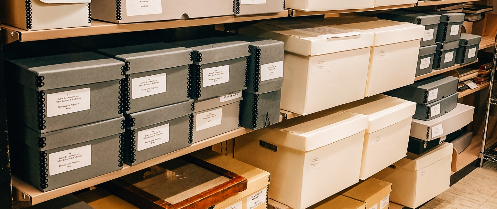


To help locate documents most archival collections have a finding aid. Finding aids are guides created by archivists to describe the contents of an archival collection. Finding aids are great tools, however they can be just as unwieldy as the collection they're describing. For example the digital finding aids for the [Ronald Dworkin papers](https://archives.yale.edu/repositories/12/resources/5843/collection_organization) or the [Louis Henry and Marguerite Cohn Hemingway Collection](https://library.udel.edu/static/purl.php?mss0100) are enormous!

Finding aids speed up historical research but they are not perfect. Even once you get down to a specific folder (typically folder is the most specific level of a finding aid) there can still be many pages or documents to sort through. For example, in the Eric E. Rofes papers, GLC 60, Box 47 Folder 8 (a collection containing newsletters from Shanti, an AIDS support and political action organization) we find ourselves with 235 pages of newsletters to sort through!

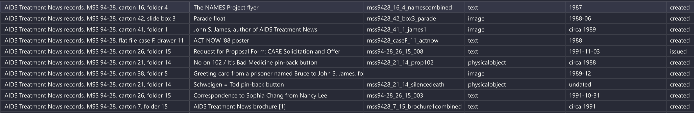

There has to be a better way! In this article I will showcase how we can use Natural Language Processing (NLP) techniques to facilitate historical research and find trends in a large body of historical text. I will be using documents from the [No More Silence](https://www.library.ucsf.edu/archives/aids/data-projects/) project from the University of California San Francisco. 

**Add example here**

# Pipeline

Before we can ask historical questions, we need get our documents into a format the computer can understand. To do this we must convert physical documents into a format computers can work with. The steps to perform this conversion are as follows: 

1. **Scan**: Historical documents must be digitized so a computer can interact with them
2. **Optical Character Recognition (OCR)**: Digitized documents are converted to text the computer can work with
4. **Chunking**: The text is fragmented into small chunks for the embedding model
4. **Embedding**: Each chunk becomes a vector representing the meaning of the chunk
5. **Storage**: We store each chunk, its vector embedding, and metadata into a database we can search

Once our documents are in a database we can perform some research!

## Step 1: Scan

I'm skipping this step because it's already been done on No More Silence and is pretty straightforward.

## Step 2: Optical Character Recognition

While this step has already been done, advances in OCR technology over the last ~5 years warrant a return to this step. Below is a page from No More Silence along with the OCR done back in 2021:

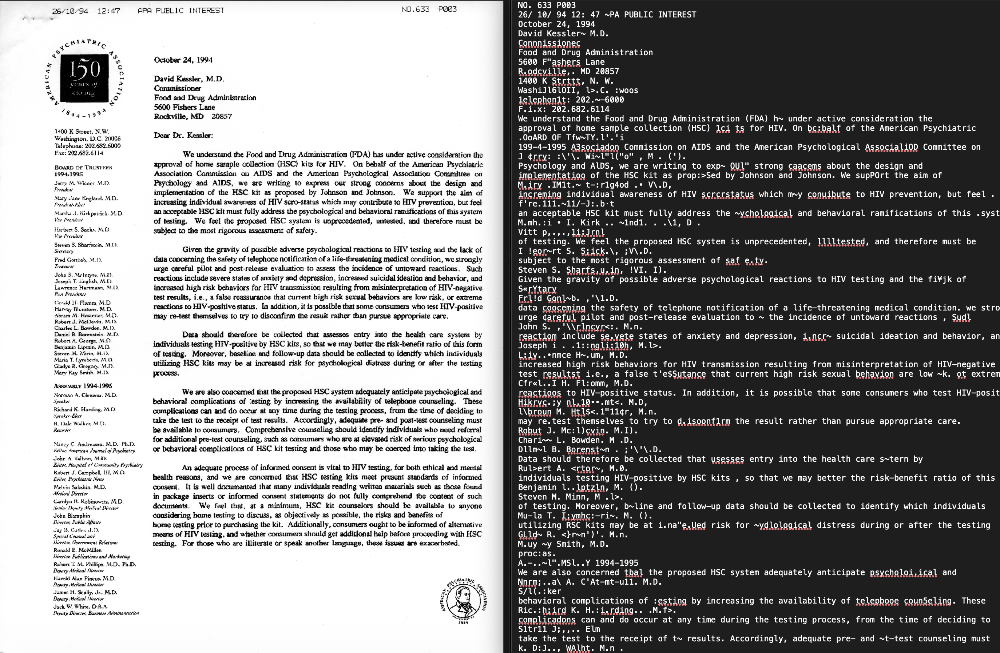

While it is very clear to humans that the list of board members and assembly members of the American Psychiatric Association are not part of the body of the letter, the computer does not know that. We end up with the lovely OCR on the right where the names of the doctors are mangled into ```M.mh.:i • I. Kirk .. ~1nd1. . .\1, D . ``` and ```GLld~ R. <}r~n')'. M.n.```. A human doesn't know who Dr ```GLld~ R. <}r~n')'. M.n.``` is, and a computer definitely won't!

Fortunately, OCR technology has advanced **significantly** in the last 5 years. I can now OCR the same document on my laptop and get the following result:

```{python}
#| eval: false
#| output: true
#| code-fold: false


from marker.converters.pdf import PdfConverter
from marker.models import create_model_dict
from marker.output import text_from_rendered

converter = PdfConverter(
    artifact_dict=create_model_dict(),
)
rendered = converter("./assets/ar200515_1_4_apacombined.pdf")
text, _, images = text_from_rendered(rendered)
```

2.5 minutes later, I get:

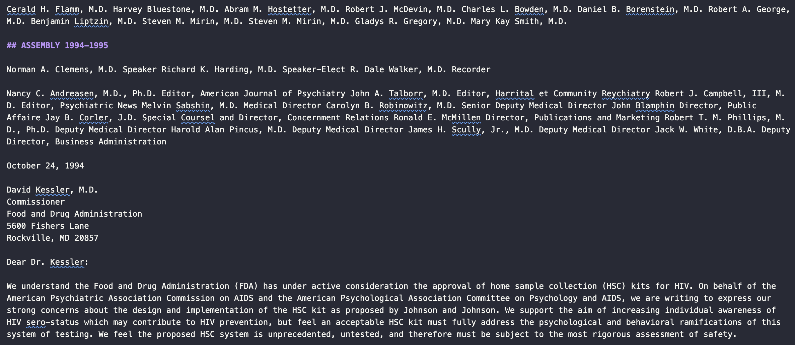

This is **much  better** than the original scan. I am using the [marker](https://github.com/datalab-to/marker) library, which runs a pipeline of deep learning models to pull out text from documents. 

Since there are ~46,000 pages of documents in this archive and I don't have access to a supercomputer, it would take me about 600 hours for me to re-ocr the entire collection. So I will stick with the original OCR provided by UCSF. 

## Step 3A: Picking a Model 

Before we chunk, we need to figure out what model we're going to use to embed our text into searchable vectors. Embedding models have advanced significantly in the past couple of years and there are some very good open source options. Before we select a model, we should understand a little bit about how they work. 

### How do Embedding Models Work?

Embedding models take text, such as 

```{python}
#| code-fold: false
text = """I have long respected you as a political leader with the guts to 
speak out controversial issues. I write to you as a concerned 
physician to call your attention to the fact that the position you 
are taking on needle exchange is dead wrong."""
```

And transforms it into a vector (a very large list of numbers):

```{python}
#| eval: false
#| code-fold: false


from sentence_transformers import SentenceTransformer

model = SentenceTransformer("Qwen/Qwen3-Embedding-0.6B")

embedding = model.encode(text)

print(embedding)
```
```[ 0.01467937  0.01435469 -0.01028924 ...  0.0262527   0.00375003 0.01165906]```

**The vector above actually contains 1024 values!**

There is a lot of fancy math that goes on behind the scenes, but the general idea of Text In -> Vector out. 

### Which Model do We Pick?

The total amount of text we can put into a model at once is limited by the **maximum sequence length** (aka context window). The sequence length is the number of tokens a model can consume at once.

You can think of a token as roughly a single word in our block of text. So when the model processes the text above, it is really ingesting "I", "have", "long", "respected" etc. I say *roughly* because there's really ~1.3 tokens per word - in the Qwen model we're using ```"physician"``` becomes ```["phys", "ician"]``` and ```"speak out"``` becomes ```["s", "peak", "out"]```

On older language embedding models the maximum sequence length can be somewhere between ~256 to ~512 tokens, and on newer models the maximum sequence length can be as high as 32,000 tokens. 

We will use ```Qwen3-Embedding-0.6B``` as our embedding model because it has an extremely large context window (32,000 tokens), is highly ranked, and can run locally on my laptop. 

Before we can run semantic searches on our collection, we need to break our document into smaller embeddable chunks. When chunking our text, we need to be aware of our models token limit. We are using ```Qwen3-Embedding-0.6B``` to embed our documents 

## Step 3B: Chunking

With such a large maximum sequence length, we have options for how we embed the documents. 


:::{.grid}

:::{.g-col-4}

### Page Level Chunking

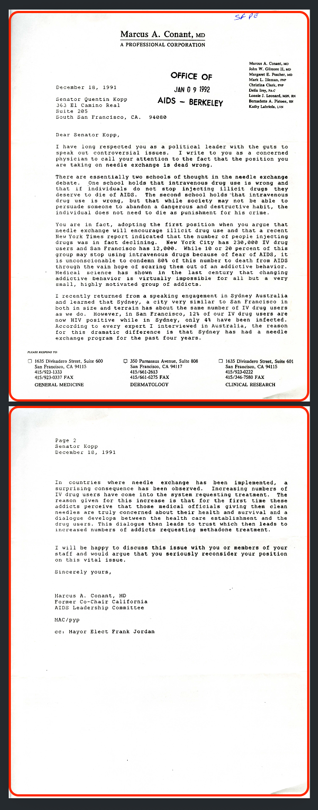

Simplest approach - each page is embedded into its own chunk. This preserves the broader context of the document but loses some precision. We will use this approach since the OCR files already have clean page breaks.


:::


:::{.g-col-4}

### Window Overlap Chunking

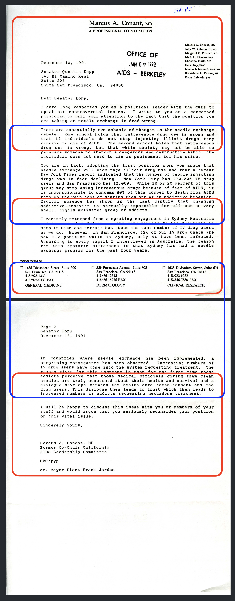

Overlapping windows are embedded into chunks. Each red or blue square represents a chunk that would be embedded. Windowed chunks overlap to retain context if a chunk splits a paragraph. This approach can lose broader semantic meaning but is very precise. 


:::


:::{.g-col-4}
### Context Aware Chunking

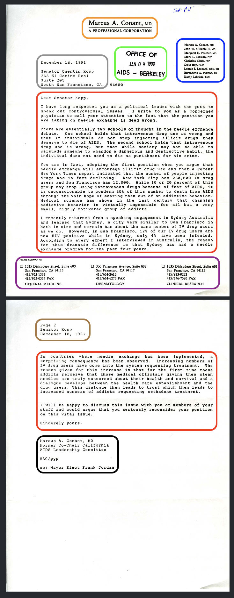

Split document into chunks that contain related information. The content of the letter is a single chunk. The headings, footers, and other information may be put into one large chunk or discarded entirely. This approach typically requires the use of an LLM to determine what is and isn't important in the document. 

:::

:::

For embedding the No More Silence dataset, I am using a mix of page and window level chunking. Some documents are already split into pages and others lack page breaks. For documents that lack page breaks I am using 512 tokens per window with 64 tokens of overlap.

## Step 4: Embed and Store 

Embedding the chunks is very straightforward, here is the command to embed a single piece of text:

```{python}
#| eval: false
#| code-fold: false

text = """...1. Information about the PARTNERS' OUTREACH PROJECT, a new research, education
and counseling program for female sexual partners of male IV drug users..."""

embeddings = model.encode(
    text, # List of chunks we're embedding
    show_progress_bar=True,
    convert_to_numpy=True,
    normalize_embeddings=True
)
```

When we store our chunks, it's very important that we include metadata so we know what document and page the chunk we're using comes from.

```{python}
#| eval: false
#| code-fold: false

metadata = {
    "doc_id":     doc_id, # "ucsf_mss95-04_001_019"
    "title":      row.get("Title"), # "Membership Meeting Minutes: August 1987"
    "collection": row.get("Collection Title"), # "Women's AIDS Network (WAN) records, MSS 95-04, Carton 1 Folder 19"
    "year":       _extract_year(row.get("Date 1")), # "1987"
    "page_num": row.get("Page_Num") # 1
}

collection.add(
    document=new_text,
    embeddings=embedding,
    metadata=metadata,
    id=metadata["doc_id"],
)
```

## Step 5: Query 

Now that our documents are chunked and embedded, we can begin querying the database. If we wanted to explore tensions between activist groups we can simply run: 

```{python}
#| eval: false 
#| code-fold: false
search(query="tensions between activist groups", n_results=25)

```

And a fraction of a second later we get:


:::{.grid}

:::{.g-col-4}

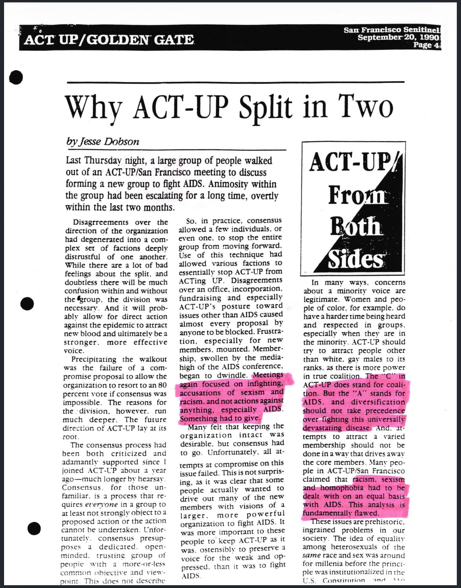

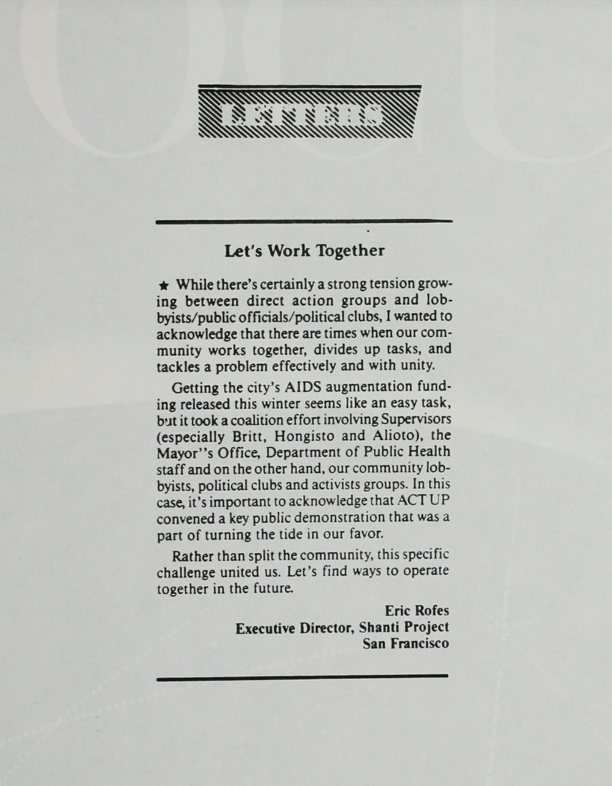

:::


:::{.g-col-4}

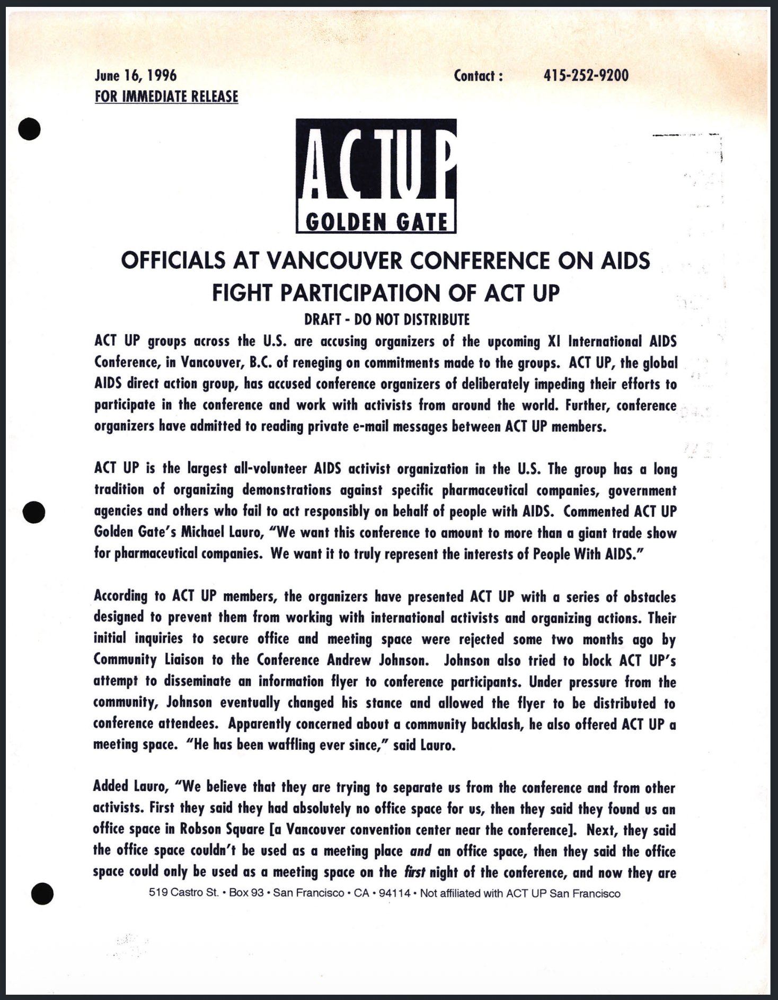

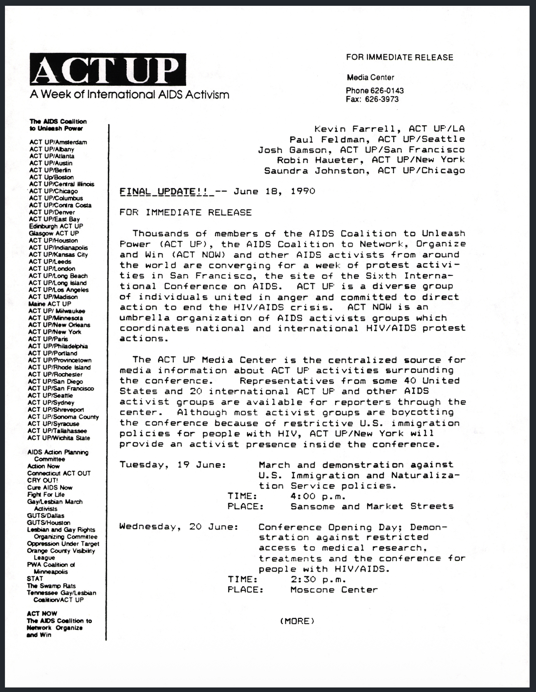

:::


:::{.g-col-4}

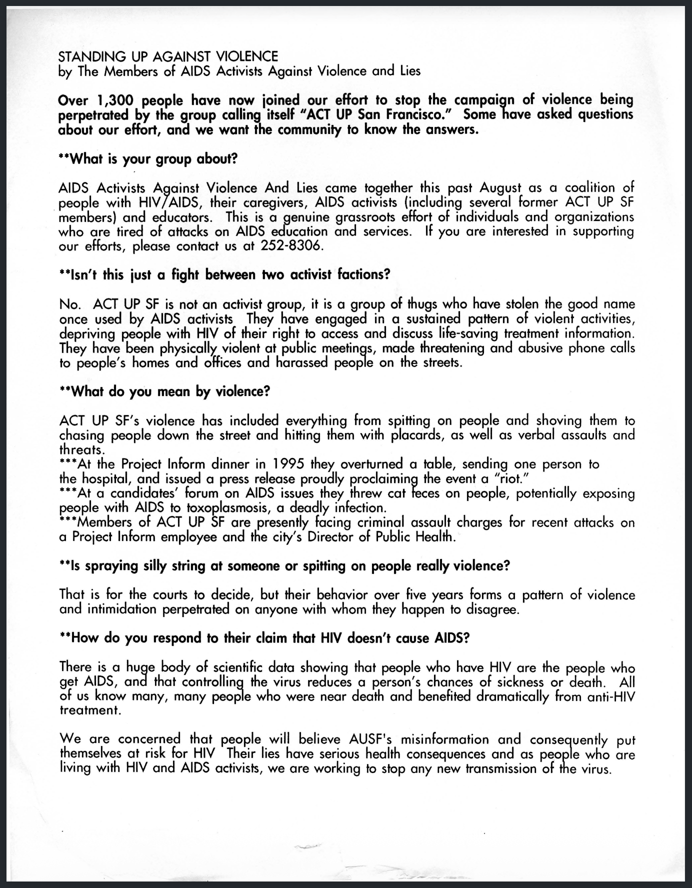

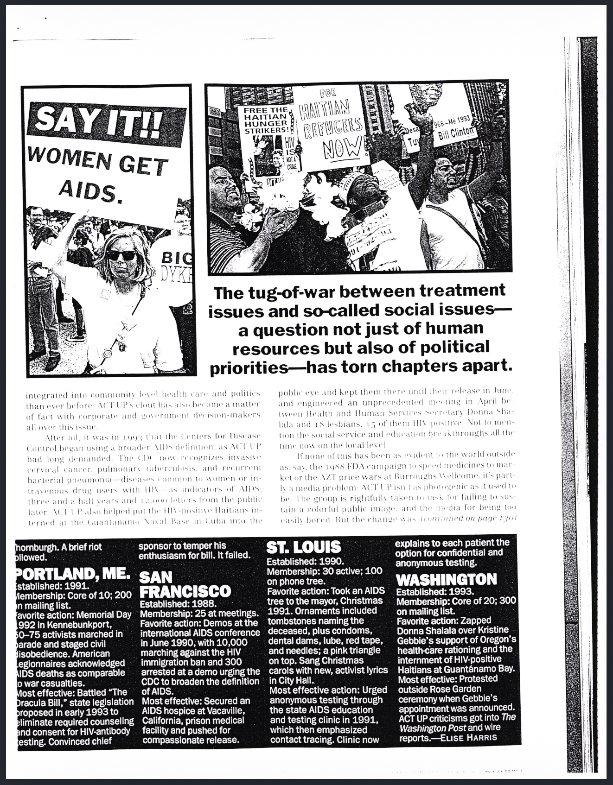

:::

:::

Incredible! We get a wide range of documents detailing the tensions and drama between various activist groups. From highest ranked to lowest ranked:

- Document A: Article on why ACT-UP (AIDS activist group) split into two organizations
- Document B: A press release accusing an AIDS conference of impeding ACT-UP's participation
- Document C: A press release from one AIDS activist group criticizing ACT-UP SF (one of the offshoots from the split in Document A)
- Document D: A letter to a newspaper encouraging AIDS activist groups to come together 
- Document E: A press release about an AIDS conference that notes some are boycotting
- Document F: An editorial about the state of ACT UP

Some documents are **semantically similar** to our original query meaning they share the same meaning. Documents A, B, and F are great examples, they literally describe tension and disagreement within and between groups. Some documents are **semantically related** documents C, D, E are related to tension between groups. Document C is direct evidence accusing another group of not being effective. Document D is the opposite of the query, it touches upon the tension but it's  calling for unity. And document E touches upon the relationship between activist groups and a formal conference via the mention of a boycott. 

While these results are excellent, you've probably noticed that the words "tension", "activist", and "group" appear in all of these passages. **If we were to run a similar keyword search on our archive, we would have to comb through ~652 documents with no ranking by relevance.**

Let's try another query 

```{python}
#| eval: false 
#| code-fold: false
search(query="shame attached to illness", n_results=25)

```

Another half second later we get

:::{.grid}

:::{.g-col-4}

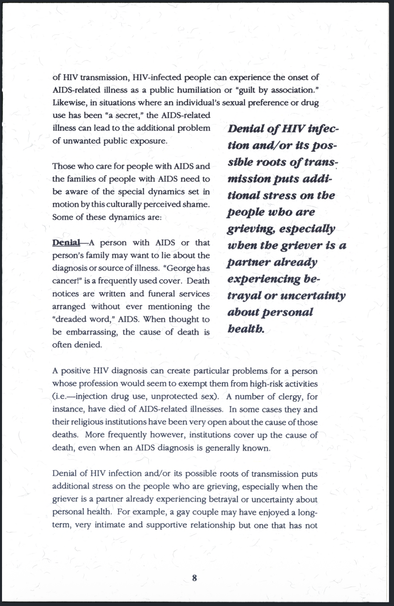

:::


:::{.g-col-4}

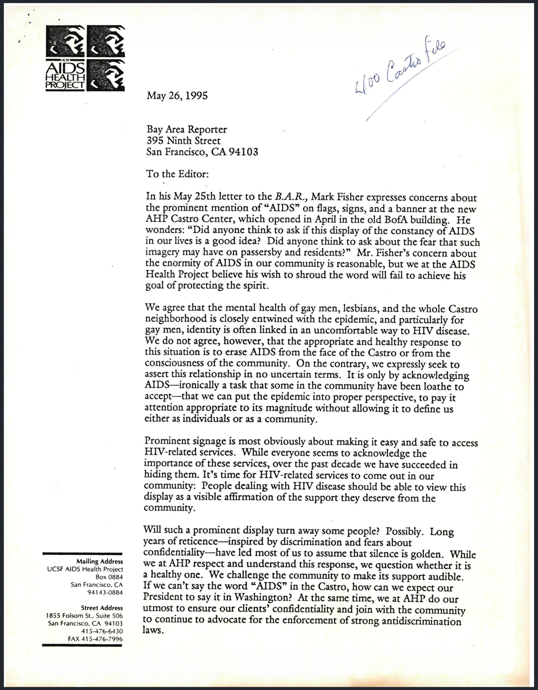

:::


:::{.g-col-4}

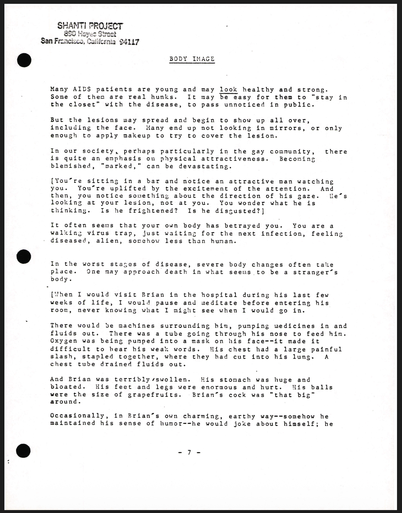

:::

:::

This document set is interesting because document A is a clear direct hit, documents B is a response to fears about associating the gay community with AIDS, and document C is about the psychological impacts of the changes AIDS brings to the body. 

**Document C is most striking as it's the clearest example of shameful feelings associated with AIDS, but the words "shame", "attached", and "illness" are not present in the identified page.**


**End of current draft, below is old content.**


But can we come up with a query that has minimal keyword overlap yet hits great sources?

Denial of Illness .709

Sick and Tired .623

AIDS Signage Castro .622


| Source | Selection | Score |
|------|---------------------------------------------|---:|
| Report on Tactics Used by ACT UP from the 6th International AIDS Conference - San Francisco 1990 (ucsf_mss98-47_001_006.pdf page 70) | "Protests by ACT UP against pharmaceutical companies also have produced important victories for people with AIDS. Burroughs Wellcome, Inc. reduced the price of AZT by 20 percent after ACT UP condemned the exorbitant cost of the antiviral drug." | .647 |
| Press Release (sfpl_glc76_010_009.pdf page 132) | "ACT UP Golden Gate will present a report card on the ethical conduct of five major pharmaceutical companies at a vocal, public demonstration on September 18th at 12:00 noon at the main entrance to the Moscone Center in San Francisco...Activists will rate the ethical policies of Abbott Labs, Merck, Hoffman La Roche, Serono Laboratories, Celgene, and the Food and Drug Administration in their treatment of people with AIDS." | .640 |
| ACT-UP Golden Gate - General Meeting Notes, Letter Regarding Activism Strategy (ucsf_mss98-47_001_002.pdf Page 1) | "Targeting drug companies has obvious advantages. They profit from AIDS; the more of us that suffer, the more they profit. Naturally, we tend to dislike, envy and mistrust them. It is easy to stir anger against drug 'profiteers,' easy to scapegoat them." | .639 |
| ACT-UP Golden Gate Treatment Issue Report Volume 2 Number 11 7th International AIDS Conference (sfpl_glc76_009_004.pdf Page 157) | "The most redundant phrase, often appearing In some form even In those abstracts and presentations which generated the aforementioned 'no shit' response was 'Further research Is needed' When will researchers realize that such comments, caused by excessive timidity and careerlsm, translate Into 'Further deaths are needed' for those of us whose lives hang In the balance." | .606 |

These results are interesting, results #1 and #2 
### Notes

CU Bolder finding aids: https://libguides.colorado.edu/c.php?g=1154758&p=8428110 

Tulane Finding Aids: https://library.tulane.edu/news/Understanding-Archives


Will use mss201501_12_39_conantcombined.pdf from "Community perspectives on needle exchange programs" (5th result)

/Users/imccabe/Developer/Personal/no-more-silence/archive/NoMoreSilence_Documents/sfpl_glc76_010_002_Redacted.ocr has a solid PDF but the OCR is empty - need a way to check which docs I'm missing


brilliant poster is in sfpl_glc76_009_007_Redacted.pdf 